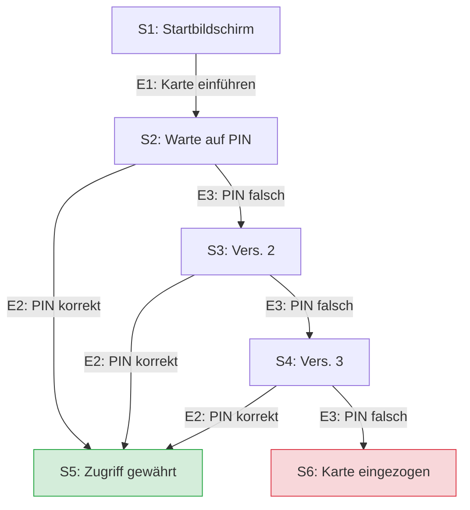

# Hausaufgabe: Zustandsübergangstest & Überdeckung

## **Teil 1: Zustandsübergangstest (Geldautomat / ATM)**

### **1. Bestimmung der Zustände, Übergänge und Ereignisse**

*   **Zustände (States):**
    1.  `S1: Startbildschirm` (Bereit für Karte)
    2.  `S2: Warte auf PIN` (Karte eingesteckt, erster Versuch)
    3.  `S3: PIN Falsch - Versuch 2`
    4.  `S4: PIN Falsch - Versuch 3`
    5.  `S5: Zugriff gewährt` (Endzustand - Erfolg)
    6.  `S6: Karte eingezogen` (Endzustand - Fehler)

*   **Ereignisse (Events / Inputs):**
    *   `E1: Karte einführen`
    *   `E2: Korrekte PIN eingegeben`
    *   `E3: Falsche PIN eingegeben`

*   **Übergänge (Transitions):**
    *   Von `S1` zu `S2` via `E1`
    *   Von `S2` zu `S5` via `E2`
    *   Von `S2` zu `S3` via `E3`
    *   Von `S3` zu `S5` via `E2`
    *   Von `S3` zu `S4` via `E3`
    *   Von `S4` zu `S5` via `E2`
    *   Von `S4` zu `S6` via `E3`

---

### **2. Zustandsübergangstabelle**

| Aktueller Zustand | Ereignis (Eingabe) | Neuer Zustand | Aktion |
| :--- | :--- | :--- | :--- |
| **S1: Startbildschirm** | E1: Karte einführen | **S2: Warte auf PIN** | Aufforderung zur PIN-Eingabe |
| **S2: Warte auf PIN** | E2: PIN korrekt | **S5: Zugriff gewährt** | Konto-Dashboard anzeigen |
| **S2: Warte auf PIN** | E3: PIN falsch | **S3: PIN Falsch - Versuch 2** | Fehlermeldung anzeigen |
| **S3: PIN Falsch - Versuch 2** | E2: PIN korrekt | **S5: Zugriff gewährt** | Konto-Dashboard anzeigen |
| **S3: PIN Falsch - Versuch 2** | E3: PIN falsch | **S4: PIN Falsch - Versuch 3** | Letzte Warnung anzeigen |
| **S4: PIN Falsch - Versuch 3** | E2: PIN korrekt | **S5: Zugriff gewährt** | Konto-Dashboard anzeigen |
| **S4: PIN Falsch - Versuch 3** | E3: PIN falsch | **S6: Karte eingezogen** | Einzug der Karte & Blockierung |

### **3. Zustandsübergangsdiagramm (Textdarstellung / Mermaid)**

---
---

## **Teil 2: Überdeckung (Code-Analyse)**

### **1. Kontrollflussgraph (Zustandsübergangsdiagramm des Codes)**

Der Code lässt sich logisch in folgende sequenzielle Kontrollknoten unterteilen:
*   **Knoten A:** `print("Additional Statement 1")` (Start)
*   **Knoten B:** Bedingungsprüfung `if price > 50 or isPrimeShoppingMember`
*   **Knoten C:** `print("Additional Statement 2")` (Nur wenn B wahr ist)
*   **Knoten D:** Bedingungsprüfung `if price > 25 and numberOfItems < 3`
*   **Knoten E:** `print("Additional Statement 3")` (Wenn D wahr ist) -> Wechselt direkt zu `return True`
*   **Knoten F:** Bedingungsprüfung `elif price > 10 and numberOfItems == 1`
*   **Knoten G:** `print("Additional Statement 4(discount)")` und `return False`
*   **Knoten H:** `return True` (Standard-Fall)
*   **Knoten I:** `print("Additional Statement 5")` (**Toter Code!** Da vorher ein `return` steht, wird dieser Knoten niemals erreicht).

---

### **2. Abdeckung der bestehenden Testfälle (Berechnung)**

Es gibt insgesamt **10 ausführbare Anweisungen** (Statements) im Code und **6 strukturelle Zweige** (Branches) durch die IF-Else-Logik.

#### **Analyse der 4 bereitgestellten Testfälle:**

1.  `is_shipping_free(30, 2, True)`
    *   Bedingung 1 (Price > 50 oder Prime): **Wahr** (wegen Prime=True). Gibt "Statement 2" aus.
    *   Bedingung 2 (Price > 25 und Items < 3): **Wahr** (30 > 25 und 2 < 3). Gibt "Statement 3" aus und beendet mit `return True`.
2.  `is_shipping_free(15, 1, False)`
    *   Bedingung 1: Falsch.
    *   Bedingung 2: Falsch (15 nicht > 25).
    *   Bedingung 3 (Price > 10 und Items == 1): **Wahr** (15 > 10 und 1 == 1). Gibt "Statement 4" aus und beendet mit `return False`.
3.  `is_shipping_free(15, 1, True)`
    *   Bedingung 1: **Wahr** (wegen Prime=True). Gibt "Statement 2" aus.
    *   Bedingung 2: Falsch.
    *   Bedingung 3: **Wahr**. Gibt "Statement 4" aus und beendet mit `return False`.
4.  `is_shipping_free(50, 1, False)`
    *   Bedingung 1: Falsch (50 ist nicht strikt > 50).
    *   Bedingung 2: **Wahr** (50 > 25 und 1 < 3). Gibt "Statement 3" aus und beendet mit `return True`.

#### **Berechnung der aktuellen Metriken:**
*   **Anweisungsüberdeckung (Statement Coverage):** 
    *   Erreichte Anweisungen: Statement 1, Statement 2, Statement 3, Statement 4 und die Returns.
    *   Nicht erreicht: `print("Additional Statement 5")` (Toter Code).
    *   **Ergebnis:** **90%** (9 von 10 Anweisungen wurden ausgeführt).
*   **Zweigüberdeckung (Branch Coverage):**
    *   Alle logischen Zweige der `if`- und `elif`-Strukturen wurden durch die Kombination der Testfälle (Wahr/Falsch-Pfade) vollständig abgedeckt.
    *   **Ergebnis:** **100%** der Zweige abgedeckt.

---

### **3. Berechnung, wenn "Additional Statement 5" entfernt wird**

Wenn die nicht erreichbare Zeile `print("Additional Statement 5")` gelöscht wird, verringert sich die Gesamtzahl der Anweisungen im Quellcode auf die exakt ausführbaren 9 Anweisungen.

*   **Anweisungsüberdeckung (Statement Coverage):** **100%** (Alle verbleibenden 9 Anweisungen werden nun vollständig durchlaufen).
*   **Zweigüberdeckung (Branch Coverage):** **100%** (Bleibt unverändert maximal abgedeckt, da sich an der Kontrollfluss-Verzweigung nichts geändert hat).
